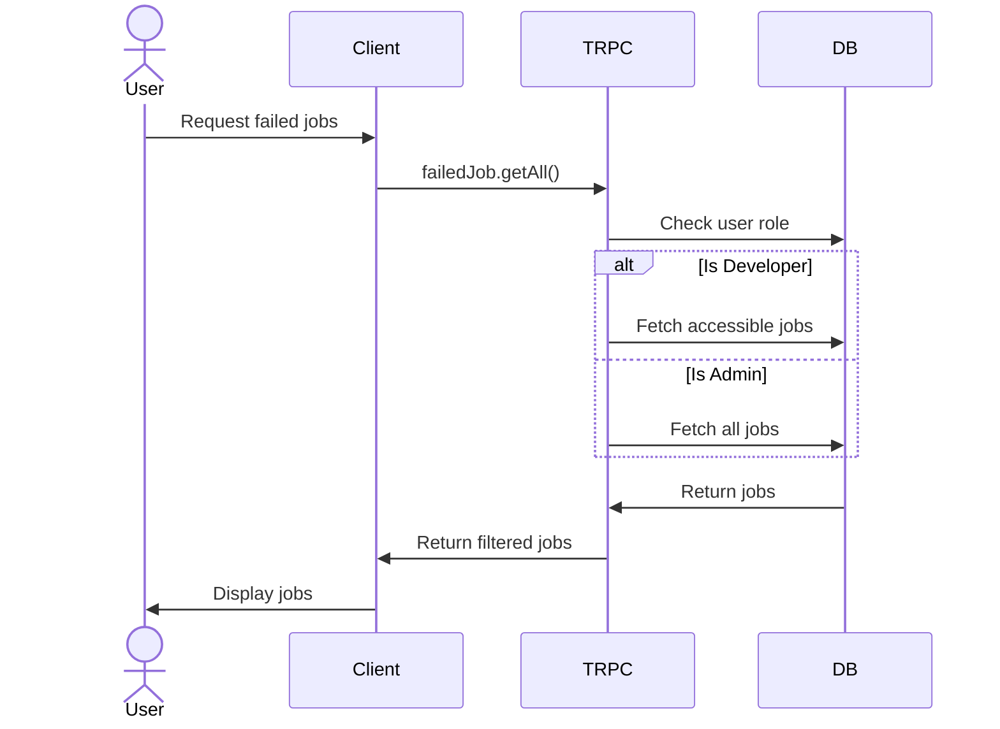
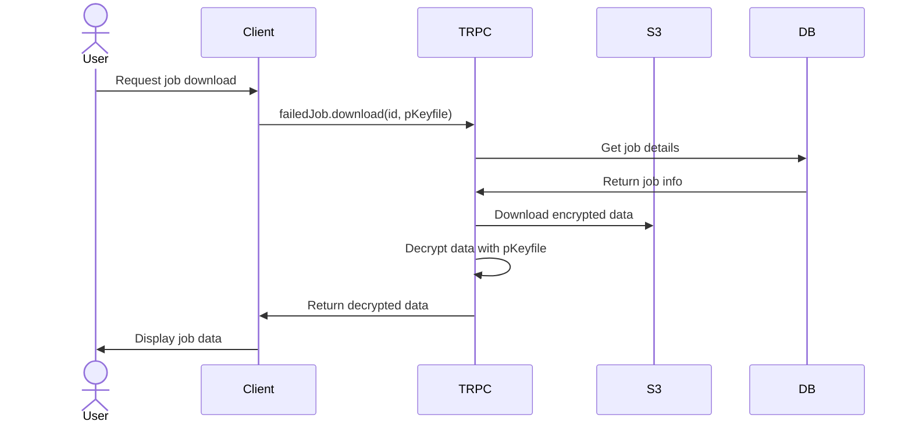
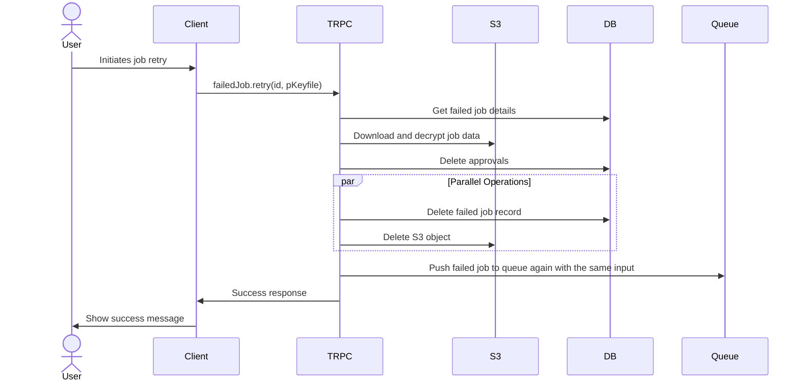
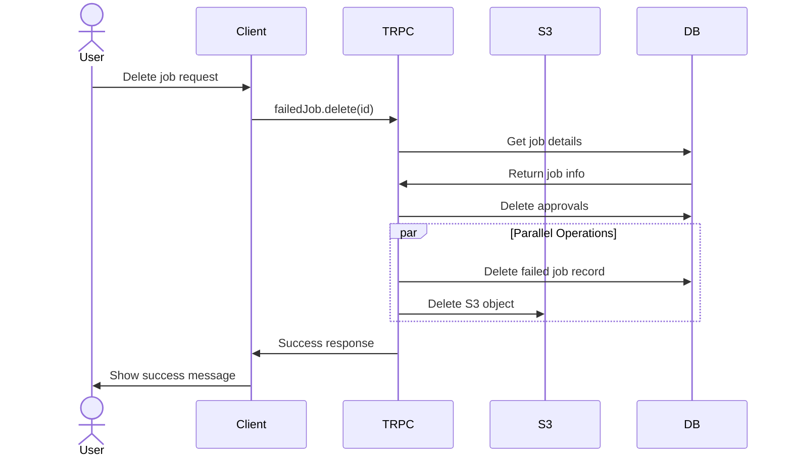
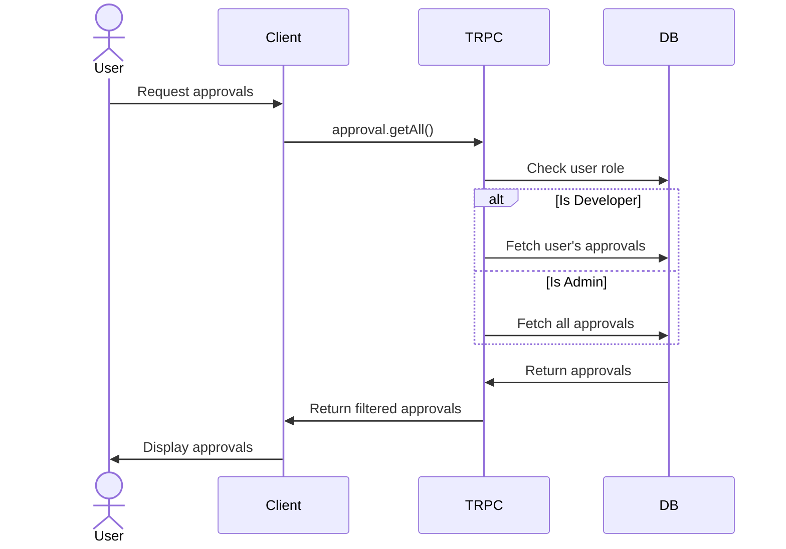
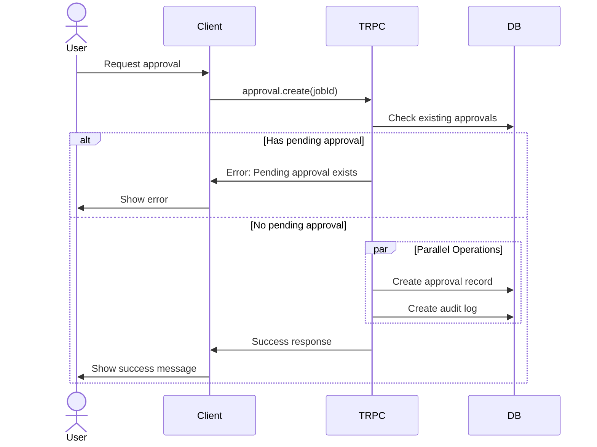
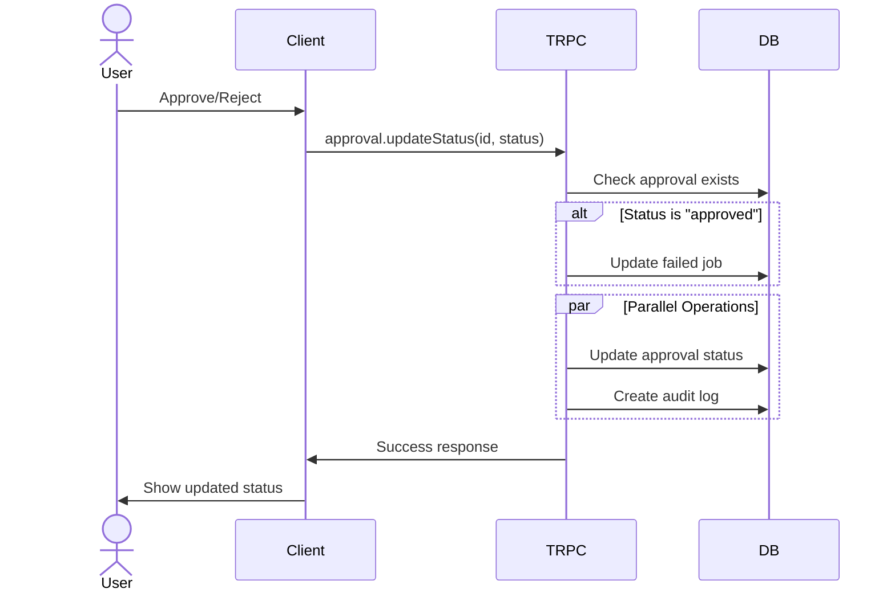
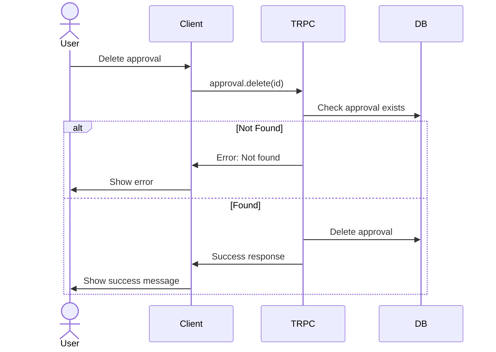
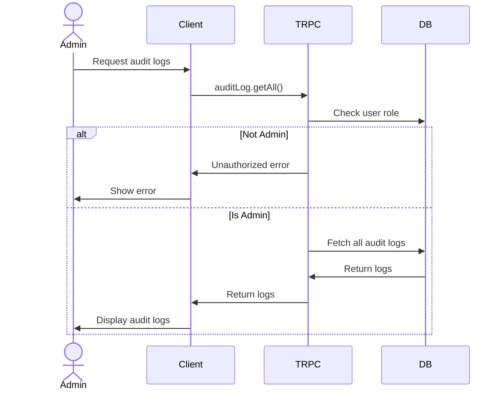
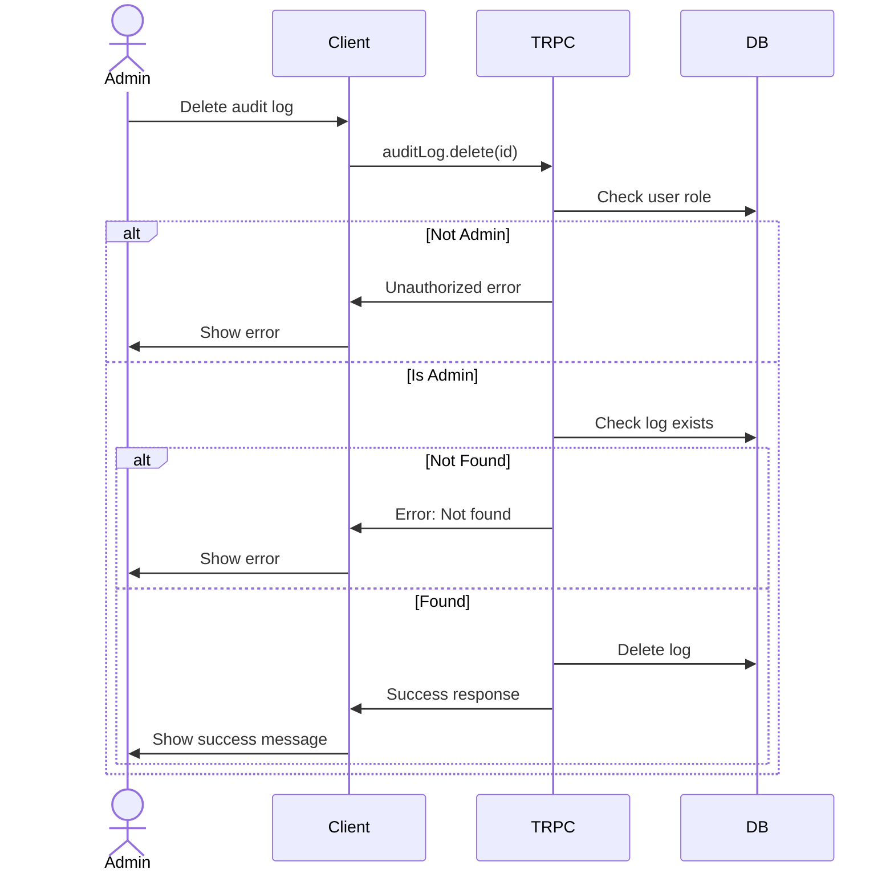

# TRPC API Documentation

## Overview

This document outlines the TRPC procedures (endpoints) available in the application and their respective flows.

## Routers

### 1. Failed Job Router (`/src/server/api/trpcRouters/failedJob.ts`)

#### Endpoints:

##### `failedJob.getAll`

- **Type**: Query
- **Authentication**: Protected (requires login)
- **Purpose**: Retrieves all failed jobs accessible to the user
- **Authorization**:
  - Developers can only see jobs they have access to
  - Admins can see all jobs
- **Returns**: List of failed jobs with their details

##### `failedJob.download`

- **Type**: Mutation
- **Authentication**: Protected
- **Purpose**: Downloads and decrypts failed job data from S3
- **Parameters**:
  - `id`: Job ID
  - `pKeyfile`: Private key for decryption (Uint8Array)
- **Returns**: Decrypted job data

##### `failedJob.retry`

- **Type**: Mutation
- **Authentication**: Protected
- **Purpose**: Retries a failed job by requeuing it
- **Flow**:
  1. Downloads and decrypts job data
  2. Deletes associated approvals
  3. Removes failed job record
  4. Creates new job in the appropriate queue with the same input
- **Parameters**:
  - `id`: Job ID
  - `pKeyfile`: Private key for decryption

##### `failedJob.delete`

- **Type**: Mutation
- **Authentication**: Protected
- **Purpose**: Deletes a failed job and its associated data
- **Flow**:
  1. Deletes associated approvals
  2. Removes S3 object
  3. Deletes failed job record
- **Parameters**:
  - `id`: Job ID

### 2. Approval Router (`/src/server/api/trpcRouters/approval.ts`)

#### Endpoints:

##### `approval.getAll`

- **Type**: Query
- **Authentication**: Protected
- **Purpose**: Retrieves all approvals
- **Authorization**:
  - Developers see only their approvals
  - Admins see all approvals
- **Returns**: List of approvals with associated job details

##### `approval.create`

- **Type**: Mutation
- **Authentication**: Protected
- **Purpose**: Creates a new approval request
- **Validation**: Prevents duplicate pending approvals
- **Parameters**:
  - `jobId`: ID of the failed job
- **Side Effects**: Creates audit log entry

##### `approval.updateStatus`

- **Type**: Mutation
- **Authentication**: Protected
- **Purpose**: Updates approval status (approve/reject)
- **Parameters**:
  - `id`: Approval ID
  - `status`: "approved" or "rejected"
- **Side Effects**:
  - Updates failed job if approved
  - Creates audit log entry

##### `approval.delete`

- **Type**: Mutation
- **Authentication**: Protected
- **Purpose**: Deletes an approval
- **Parameters**:
  - `id`: Approval ID

### 3. Audit Log Router (`/src/server/api/trpcRouters/auditLog.ts`)

#### Endpoints:

##### `auditLog.getAll`

- **Type**: Query
- **Authentication**: Protected
- **Purpose**: Retrieves all audit logs
- **Authorization**: Admin only
- **Returns**: List of all audit logs

##### `auditLog.delete`

- **Type**: Mutation
- **Authentication**: Protected
- **Purpose**: Deletes an audit log entry
- **Parameters**:
  - `id`: Audit log ID

